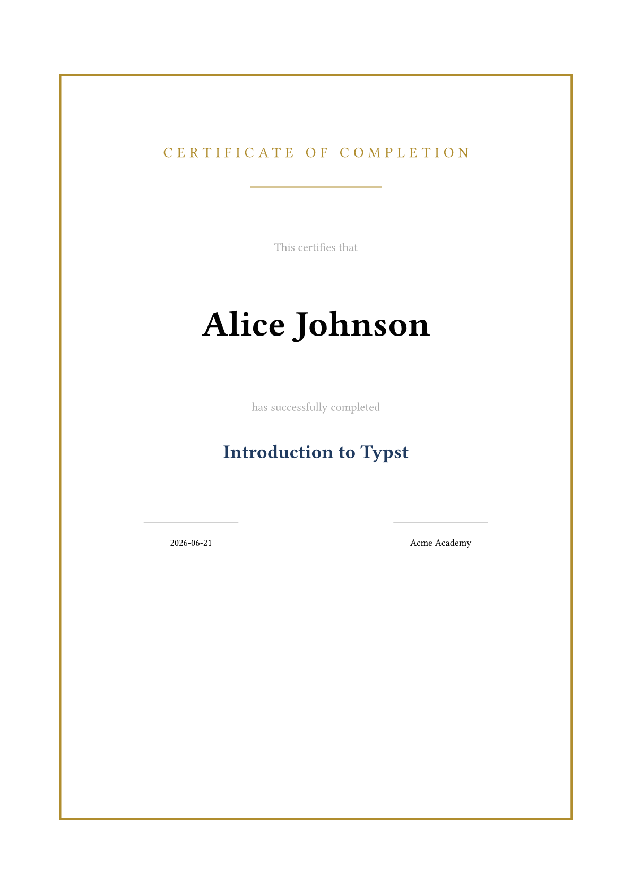

# mergetyp

Mail-merge for PDFs, powered by [Typst](https://github.com/typst/typst).

`mergetyp` generates one PDF per data record from a Typst template and a CSV, JSON, or YAML file.

## Requirements

Install the Typst CLI first:

```bash
typst --version
```

Install Typst from the official releases, Homebrew, or Cargo:

```bash
brew install typst
cargo install --locked typst-cli
```

## Install

```bash
python -m pip install mergetyp
```

Until the package is published:

```bash
python -m pip install .
```

## Quick start

`template.typ`:

```typst
#let render(record) = {
  set page(paper: "a4")

  [
    Hello, #record.name!
  ]
}
```

`data.csv`:

```csv
name
Alice
Bob
Charlie
```

Run:

```bash
mergetyp template.typ data.csv -o out --name-pattern "{name}.pdf"
```

Outputs:

```text
out/Alice.pdf
out/Bob.pdf
out/Charlie.pdf
```

Generated example:

[examples/certificate/generated/certificate-1.pdf](examples/certificate/generated/certificate-1.pdf)



## Template contract

Every template must export `render(record)`.

For every record, `mergetyp` generates temporary Typst source like this:

```typst
#import "template.typ": render
#render((name: "Alice",))
```

Use `record.name` for safe ASCII keys. Use `record.at("field name")` for keys with spaces, dashes, Unicode,
or other non-identifier characters.

## Data formats

| Format | Behavior |
|---|---|
| `.csv` | CSV cells are strings. By default `mergetyp` coerces booleans, integers, floats, and empty cells. |
| `.json` | Top-level object or array of objects. Values keep native JSON types. |
| `.yaml`, `.yml` | Top-level mapping or sequence of mappings. Values keep native YAML types. |

Use `--no-coerce` to keep all CSV cells as strings.

## CLI

```text
mergetyp TEMPLATE DATA [options]

Options:
  -o, --output DIR             Output directory. Default: out
  --name-pattern PATTERN       Filename pattern. Default: {index}.pdf
  --no-coerce                  Keep CSV values as strings
  -j, --jobs N                 Parallel Typst jobs
  --compile-timeout SECONDS    Timeout for one Typst compile. Default: 60
  --dry-run                    Validate plan without generating PDFs
  --limit N                    Process at most N records
  --offset N                   Skip first N records
  --encoding ENCODING          CSV encoding. Default: utf-8
  --collision POLICY           error, overwrite, or rename. Default: error
  --verbose                    Enable debug logs
  --quiet                      Show only errors
  --version                    Print version
```

## Exit codes

| Code | Meaning |
|---:|---|
| `0` | Success |
| `1` | Validation, rendering, timeout, or output error |
| `2` | Template or data file not found |
| `130` | Interrupted by Ctrl+C |

## Security

Typst templates are executable document code. Run `mergetyp` only with trusted templates. Do not keep secrets in the
template directory because Typst can read files inside its project root.

Temporary `.typ` files contain record data and are deleted after rendering. If the process is killed by the operating
system, cleanup is not guaranteed.

## Examples

See:

```text
examples/certificate
examples/invoice
```

## License

MIT.
